# INFINITE LOYOLA STAIRS
수많은 계단을 올라가야 도착할 수 있는 높디 높은 **서강대학교 로욜라도서관**!  
<엔플라이 스튜디오>의 "무한의 계단" 게임을 모티브로 하여서,  
서강대학교 후문 쪽 J관에서부터 D관을 거쳐 로욜라 도서관까지 가는 길을 그려냈습니다.  
과연 **알로스**는 로욜라 도서관까지 성공적으로 도착해 공부하게 될 수 있을까요?!

**Sogang University Loyola Library** can be reached only by climbing many stairs!  
With the motif of "INFINITE STAIRS" game by <N.Fly Studio>,  
I drew a path from Building J at the back entrance of Sogang University through Building D to Loyola Library.  
Will **Alros** be able to successfully reach the Loyola Library and study?!  

## 개요
- 과목명: [MAS2011] Introduction to Visual Media Programming 
- 프로젝트 이름: INFINITE LOYOLA STAIRS
- 프로젝트 지속 기간: 2023.11.17 ~ 2023.12.27
- 개발 언어: Python
- 제작자: 서강대학교 국어국문학과 20220042 김현서

## 게임 설명

### 메인 캐릭터
|학교 캐릭터 알로스|게임 캐릭터 알로스|
|---|---|
|||

- 메인 캐릭터: **알로스** (서강대학교 대표 캐릭터)  
  2023년 리뉴얼된 서강대학교의 캐릭터 **알로스**를 메인 캐릭터로 하였습니다.

### 배경
|1. J관-TE관|2. D관|3. 로욜라 도서관|
|:---:|:---:|:---:|
|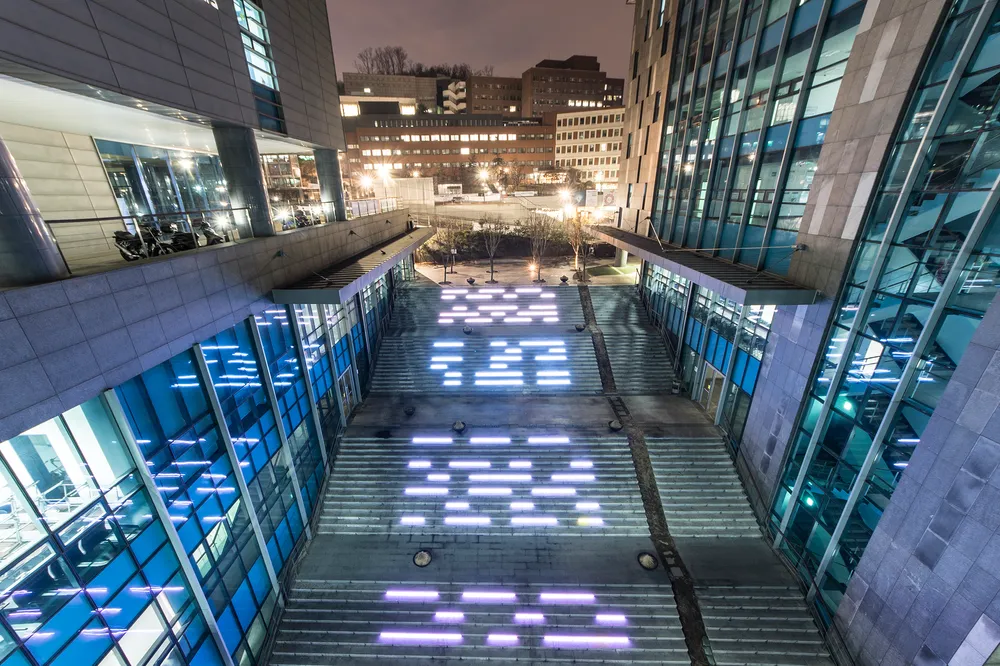|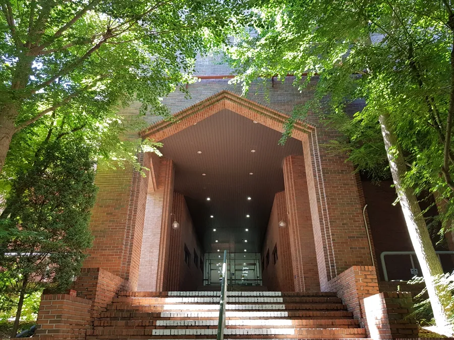|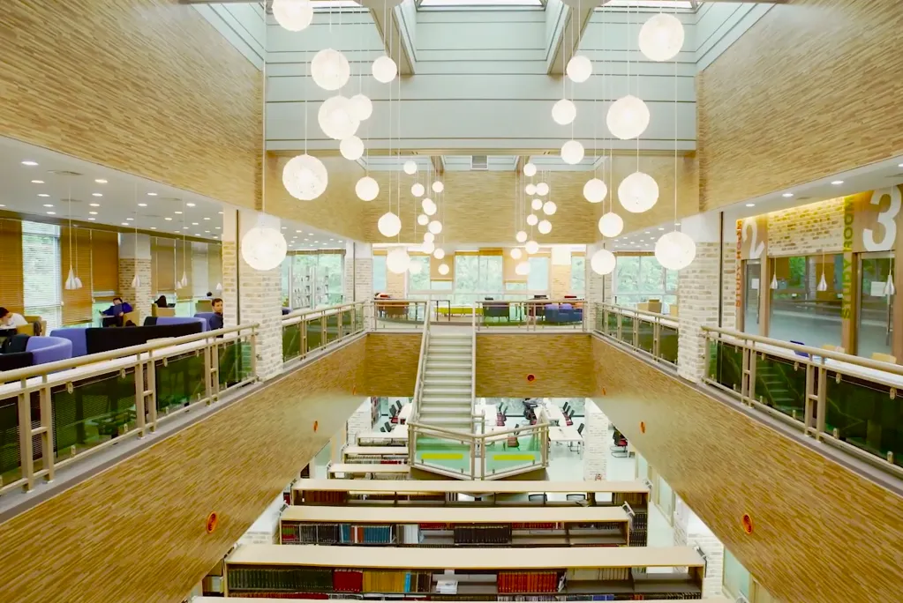|
||||
|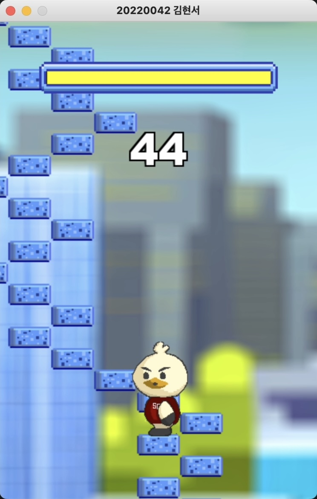|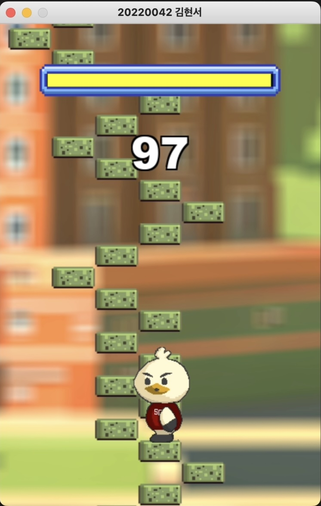|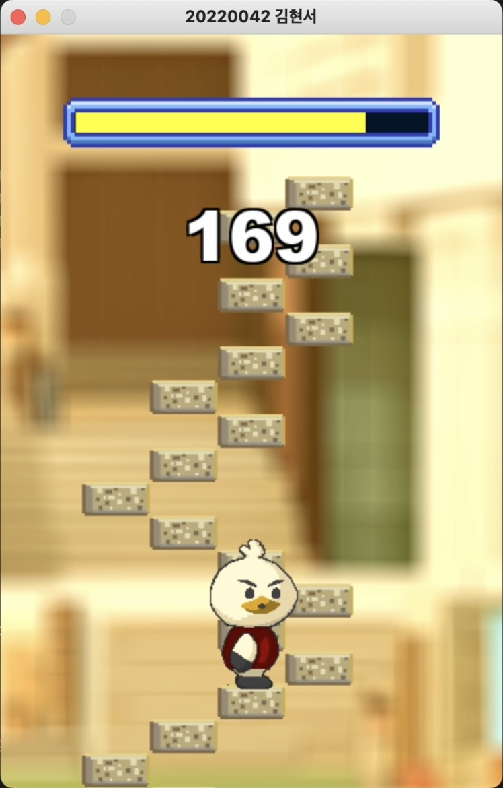|

- Level 1: **J-TE 사이** 계단
- Level 2: **D관** 계단
- Level 3: **로욜라 도서관** 계단

### 게임 화면
|초기 화면|게임 시작|게임 진행 중|게임 오버|게임 성공|
|---|---|---|---|---|
|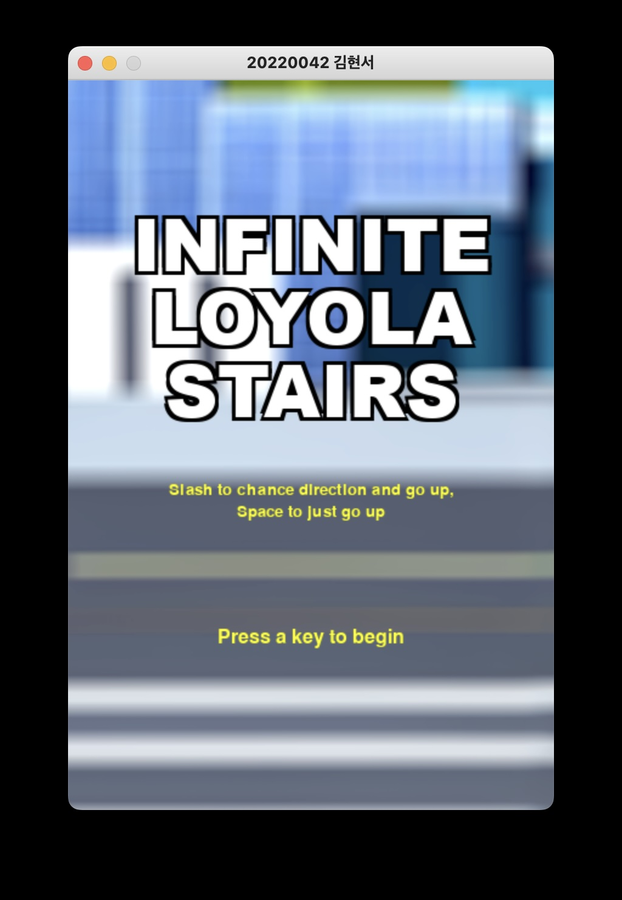|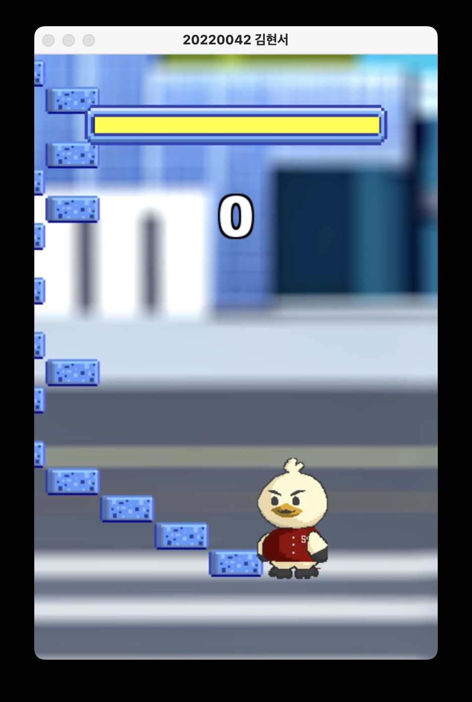|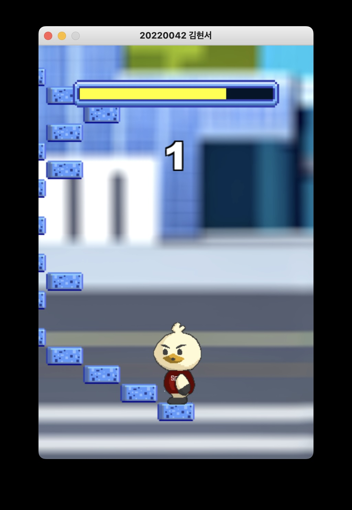|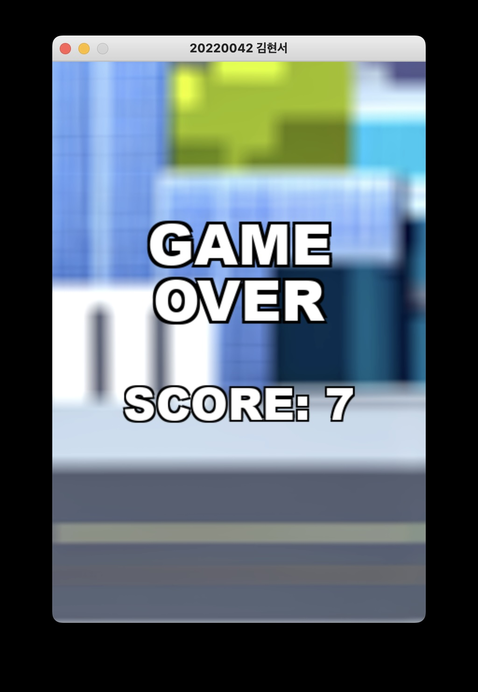|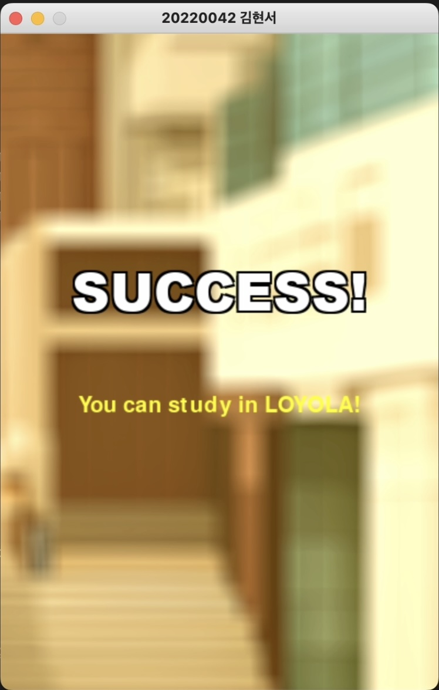|

- 초기 화면에서 키보드 키 중 아무거나 누르면 게임이 시작됩니다.
- 게임 시작 화면에서 계단 방향에 알맞게 계단을 올라가면, HP가 닳기 시작합니다.
- 오른 계단 수가 많아질수록 HP의 닳는 속도가 빨라집니다.
- HP가 모두 닳거나, 주어진 계단 방향의 반대로 계단을 올라가면, 알로스가 화면 아래로 떨어지고 게임 오버 됩니다.
- J-TE, D, 로욜라 도서관의 계단을 모두 오르면 성공합니다.

### 게임 플레이 방식

|이동 방향|방향 전환 X|방향 전환 O|
|---|---|---|
|키보드|**SPACE bar**|**Slash key**|

- 스페이스 키를 누르면 기존의 방향대로 계단을 올라갑니다.
- 슬래시 키를 누르면 기존의 반대 방향으로 계단을 올라갑니다.

##
그럼 재미있게 플레이 해주세요! :)
